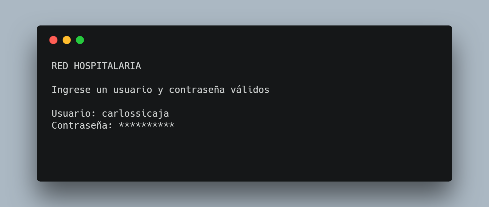

# Red Hospitalaria

Es un sistema que permite realizar compras de medicamentos en línea, así como digitalizar la información de los hospitales que conformen la red de hospitales.

El sistema también permite la creación de usuarios para acceder a los módulos, los usuarios poseen un perfil el cuál el usuario Administrador es el único capaz crear y modificar su información.

## Módulos

El sistema presenta una interfaz con diferentes módulos. Cada módulo proporciona herramientas específicas según el rol del usuario.

### **Farmacia**

Compra de médicamento en línea para los pacientes agregados en el sistema.

Acceso al módulo:

- Usuarios con rol de paciente
- Administrador

### **Ingreso de Datos**

En este módulo los usuarios con rol de médico pueden seleccionar cualquiera de los hospitales registrados en el sistema he ingresar la información que solicita.

Acceso al módulo: 

- Usuarios con rol de médico
- Administrador

### **Reportes**

Este módulo ofrece la información ingresada a en el módulo de Ingreso de Datos para ser visualizada por cualquier usuario que ingrese en el sistema.

Acceso al módulo:

- Usuarios con rol de paciente
- Usuairos con rol de médico
- Administrador

### **Administrador**

En este módulo el Administrador puede crear a los usarios en el sistema y módificar su información, también puede actualizar el inventario de Farmacia.

Acceso al módulo:

- Administrador

## Inicio de Sesión

Para ingresar al sistema se requiere un usuario y contraseña correctos, si el usuario y/o la contraseña son incorrectos se resta un intento de inicio de sesión. Si luego de 3 intentos el usuario y/o contraseña son incorrectos el usuario será bloqueado por el sistema, siendo el Administrador el único con la capacidad para desbloquearlo.

## Desarrollo

* [Visual Studio Code](https://code.visualstudio.com/) - Editor de código.
* [.Net Core 2.1](https://www.microsoft.com/net/download) - .NET Core es una versión multiplataforma de .NET para crear sitios web, servicios y aplicaciones de consola.
